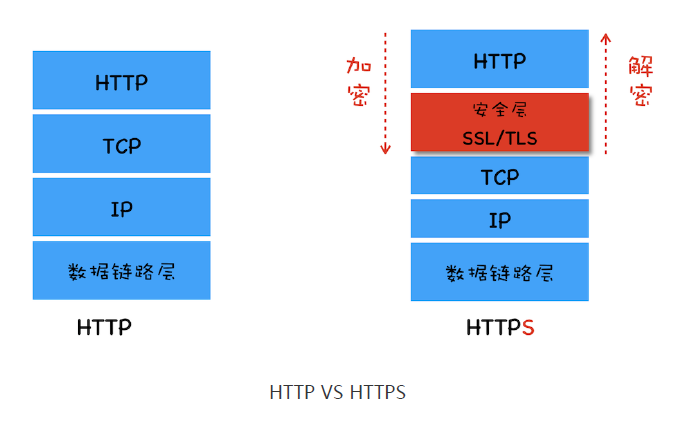
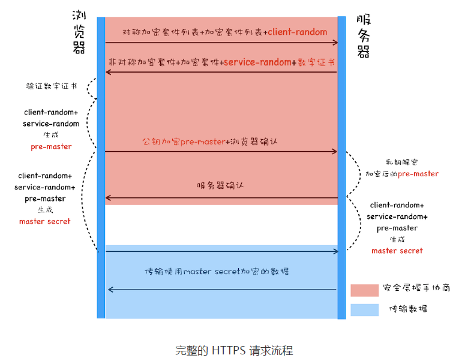

## HTTPS
HTTPS可以理解为“安全的HTTP”，具体就是在HTTP和传输层协议TCP之间加了一层SSL/TLS作为中间层来安全传输。这个文章总结一下对HTTPS的理解，主要解决以下两个问题：
- 为什么HTTP不够安全？
- HTTPS如何保障传输安全的？

## 不安全的HTTP
一个安全的通信传输过程需要有四个特性：机密性、完整性、身份认证和不可否认。

**明文传输**是HTTP协议的一个致命缺点，从HTTP报文交给TCP传输层后，在同一个设备上会经过网络层、数据链路层和物理层，还会经过许多交换机和路由器等网络节点设备，数据在这中间任何一个环节都有可能被窃取或篡改，因此数据的**机密性**和**完整性**都没有得到保障。

黑客不仅可以窃取和篡改传输过程中的数据，还可以完全伪装成用户客户端或者服务端来窃取数据。比如用户A想要访问B站点，黑客就可以通过DNS劫持来伪装成B站点，这样用户A发送的数据全部被黑客站点获取，如果没有**身份认证**用户A无法区分B站点和黑客站点，这样也会造成数据泄露。
## 加密方案
为了解决明文传输机密性的问题，HTTPS引入的SSL/TLS提供了加密方案。
### 对称加密
对称加密是最简单的加密方式，**用于加密和解密的密钥是相同的**。在两端正式进行通信传输之前，先协商好一套对称加密方案。具体做法大致如下：

- 客户端生成随机数cliet-random，将随机数和对称加密套件列表发送给服务端
- 服务端收到后选择一个加密套件，也生产一个随机数server-random，返回给客户端
- 两端分别通过client-random和server-random生成**密钥master-secret**
- 两端基于**密钥master-secret**和选择的加密套件进行数据的加密传输

但是这样存在一个**密钥交换**的安全问题：黑客窃取了协商加密阶段的随机数和加密套件后，由于各种算法都是公开的，可以自行生成密钥并且解密截获到的密文数据。
### 非对称加密
非对称加密有公钥和私钥两个不同的密钥，具有**单向性**的特点，即：**通过公钥加密的密文只能用私钥来解密，通过私钥机密的密文只能用公钥来解密。**
私钥是私密的自己保存的，而公钥是要公开分发的。对服务器来讲，就是要保存自己的私钥，将公钥分发给各个客户端。使用非对称加密进行数据传输的大致过程如下：

- 客户端发送非对称加密套件列表给服务端
- 服务端选择一个加密套件，并连同自己的公钥一起发送给客户端
- 客户端使用公钥对传输数据进行加密和解密
- 服务端使用私钥对传输数据进行加密和解密

非对称加密也存在问题：一是黑客也可以获取对应的公钥，因此从服务端响应的数据也是能被获取和解密的；二是非对称加密和解密的效率较低，影响用户打开页面的速度。

### 混合加密
鉴于两种加密都有各自的问题，目前TLS采用混合加密的方式，做法就是**在密钥交换阶段使用非对称加密，在数据传输阶段使用对称加密**，大致过程如下：

- 客户端发送对称加密套件列表、非对称加密套件列表和生成的随机数client-random
- 服务端选择一个对称加密套件、一个非对称加密套件，并将生成的随机数server-random、公钥一起返回给客户端
- **客户端使用client-random和server-random生成pre-master,使用公钥将pre-master加密发送给服务端**
- 客户端和服务端分别使用client-random、server-random和pre-master三组随机数生成对称密钥
- 双方使用对称密钥进行加密传输

由于第三组随机数pre-master是客户端生成并且用公钥发送的，黑客没有私钥获取到也无法解密，因此无法得到最终加密使用的对称密钥，从而无法解密出使用对称密钥通信的数据。
## 摘要算法
实现完整性的手段主要是依靠摘要算法，摘要算法将原文通过哈希函数生成一串字符串。原文中的任何改动都会引起该字符串的改动。该字符串即为原文的摘要，在发送原文的时候将摘要附加在后面，接收方在收到数据后也通过同样的哈希函数将原文进行转换并比对摘要，由此来验证数据的完整性。
## 数字证书
最后需要解决身份认证的问题，在上述例子中：A客户想要访问B站点，那么B站点如何向A证明自己就是B站点呢？在混合加密方案中，任何人或机构都可以分发自己的公钥，要想证明这个公钥确实是属于B站点，就需要引入第三方证书认证机构CA来认证。

互联网上有几个知名的CA，他们通过私钥来给认证的站点颁发数字证书，而操作系统和浏览器内置的各大CA的公钥可以通过解密证书来达到验证的目的。

## HTTPS建立连接流程
综上，完整的HTTPS的密钥协商和数据传输过程如下：
- 客户端发送对称加密套件列表、非对称加密套件列表和生成的随机数client-random
- 服务端选择一个对称加密套件、一个非对称加密套件，并将生成的随机数server-random、**数字证书（数字证书包含服务端的公钥）**一起返回给客户端
- 客户端先对数字证书进行验证，验证成功后再使用client-random和server-random生成pre-master,使用公钥将pre-master加密发送给服务端
- 客户端和服务端分别使用client-random、server-random和pre-master三组随机数生成对称密钥
- 双方使用对称密钥进行加密传输

