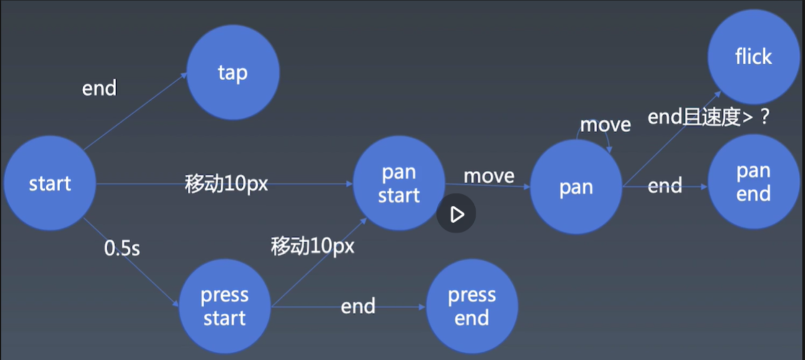

## 定义手势逻辑和事件
为了支持轮播图的手动拖拽，同时支持移动场景。因此基于鼠标事件和触摸事件抽象出一套手势逻辑：

- tap：轻点
  - tap事件：鼠标点击；手指点击
- press：长按
  - press事件：鼠标点击超过0.5s；手指点击超过0.5s
  - pressend事件：鼠标释放后或者手指从触碰离开则产生pressend
- pan：拖拽（滑动）
  - panstart事件：鼠标按下移动超过10px；手指滑动超过10px
  - pan事件：panstart后持续移动（滑动）则会持续触发
  - panend事件：pan后鼠标释放，手指离开屏幕
- flick：快速拖动（滑动）
  - flick事件：pan结束前0.5s以内的速度 > 1.5px/ms
## 基于鼠标事件处理拖拽
- 在鼠标按下时(mousedown)监听mousemove和mouseup事件
- 在鼠标释放时取消mousemove和mouseup事件
```javascript
// 鼠标事件抽象
element.addEventListener("mousedown", event => {
      let mousemove = event => {
        ......
      }
      let mouseup = event => {
        ......
        // 鼠标释放时取消move和up事件
        document.removeEventListener("mousemove", mousemove)
        document.removeEventListener("mouseup", mouseup)
      }
      // 鼠标按下时监听move和up事件
      document.addEventListener("mousemove", mousemove)
      document.addEventListener("mouseup", mouseup)
})
```
## 触摸事件
- webAPI提供了四个基础的手势事件：
  - touchstart ：当一个或多个触摸点与触控设备表面接触时触发
  - touchmove ：当一个或多个触摸点在触控设备表面移动时触发
  - touchend ：当一个或多个触摸点从触控设备表面离开时触发
  - touchcancel ：触点被中断时触发，如：用户的触点超过了设备支持的个数
- Touch：触摸点
  - identifier：因为可能会有多个触摸点，因此需要唯一标识符
  - TouchList：一组Touch，多点触控时会产生TouchList
```javascript
element.addEventListener("touchstart", event => {
  ......
})
// touchmove的前提是touchstart
element.addEventListener("touchmove", event => {
  ......
})
element.addEventListener("touchend", event => {
  ......
})
// touch事件序列可能会被打断，end变成cancel
// 类似alert等调用会打断touch，从而触发touchcancel事件
element.addEventListener("touchcancel", event => {
  ......
})
```
## 监听鼠标事件和触摸事件
- 基于 start => move => end 和cancel，封装一个可以同时监听鼠标事件和触摸事件Listener
- 构造函数参数
  - element：监听的元素
  - recogizer：识别手势事件的对象
```javascript
// 监听：鼠标事件和手势事件
// 识别：start \ move \ end \ cancel
export class Listener {
    constructor(element, recognizer){
        // 鼠标事件
        element.addEventListener("mousedown", event => {
            ......
            recognizer.start()
            ......

            let mousemove = event => {
                ......
                recognizer.move()
                ......
            }
            let mouseup = event => {
                ......
                recognizer.end()
                ......
            }
        })
        // 触摸事件
        element.addEventListener("touchstart", event => {
            ......
            recognizer.start(touch, context)
            ......
        })
        
        element.addEventListener("touchmove", event => {
            ......
            recognizer.move(touch, context)
            ......
        })
        
        element.addEventListener("touchend", event => {
            ......
            recognizer.end(touch, context)
            ......
        })
        
        // touch事件序列可能会被打断，end变成cancel
        element.addEventListener("touchcancel", event => {
            ......
            recognizer.cancel(touch, context)
            ......
        })
    }
}
```
## 识别自定义手势事件
- 封装一个Recognizer，**在move => start => end的基础事件中，识别并分发手势事件**
- 构造函数参数
  - dispatcher：模拟事件并派发 ```Element.dispatchEvent()```
```javascript
// 识别并分发：tap \ press\pressend \ panstart\pan\panend \ flick
export class Recognizer {
    constructor(dispatcher){
        this.dispatcher = dispatcher
    }
    // let handler;
    // let startX, startY;
    // let isPan = false, isTap = true, isPress = false;
    // 将手势操作和鼠标移动统一抽象
    start (point, context) {
        // console.log(context)
        // console.log("start", point.clientX, point.clientY);
        context.startX = point.clientX, context.startY = point.clientY
        // 实现flick手势，在start的时候初始化points数组
        context.points = [{
            t: Date.now(),
            x: point.clientX,
            y: point.clientY
        }]
    
        context.isTap = true
        context.isPan = false
        context.isPress = false
    
        // 0.5s如果还未move或者end则产生 [press] 事件
        context.handler = setTimeout(() => {
            context.isTap = false
            context.isPan = false
            context.isPress = true
            context.handler = null
            // console.log("press")
            this.dispatcher.dispatch("press", {})
        }, 500);
    }
    move (point, context) {
        // 判断是否移动10px，如果超过10px则产生 [panstart] 事件
        let dx = point.clientX - context.startX, dy = point.clientY - context.startY
        // 可能会存在移动超过10px又移回来的情况。因此一旦超过10px就需要设置 isPan为true
        if (!context.isPan && dx ** 2 + dy ** 2 > 100) {
            context.isTap = false
            context.isPan = true
            context.isPress = false
            context.isVertical = Math.abs(dx) < Math.abs(dy)
            this.dispatcher.dispatch("panstart", {
                startX: context.startX,
                startY: context.startY,
                clientX: point.clientX,
                clientY: point.clientY,
                isVertical: context.isVertical
            })
            // 清除检查[press]的定时器
            clearTimeout(context.handler)
        }
        if (context.isPan) {
            this.dispatcher.dispatch("pan", {
                startX: context.startX,
                startY: context.startY,
                clientX: point.clientX,
                clientY: point.clientY,
                isVertical: context.isVertical
            })
        }
        // 对瞬时的move过程中的点过滤
        // 只保留 0.5s 以内的move过的点
        context.points = context.points.filter(point => Date.now() - point.t < 500)
        context.points.push({
            t: Date.now(),
            x: point.clientX,
            y: point.clientY
        })
        // console.log("move", point.clientX, point.clientY);
    }
    end (point, context) {
        if (context.isTap) {
            // console.log("tap");
            this.dispatcher.dispatch("tap", {})
            // 清除检查[press]的定时器
            clearTimeout(context.handler)
        }
        if (context.isPress) {
            this.dispatcher.dispatch("pressend", {})
        }

        context.points = context.points.filter(point => Date.now() - point.t < 500)
        // end的时候计算最近0.5s以内move过的点的速度
        let d, v
        if (!context.points.length) {
            v = 0
        } else {
            d = Math.sqrt((point.clientX - context.points[0].x) ** 2 + 
                (point.clientY - context.points[0].y) ** 2)
            v = d / (Date.now() - context.points[0].t)
        }
        // flick： px/ms
        if (v > 1.5) {
            context.isFlick = true
            this.dispatcher.dispatch("flick", {
                startX: context.startX,
                startY: context.startY,
                clientX: point.clientX,
                clientY: point.clientY,
                isVertical: context.isVertical,
                isFlick: context.isFlick,
                velocity: v
            })
        } else {
            context.isFlick = false
        }

        if (context.isPan) {
            this.dispatcher.dispatch("panend", {
                startX: context.startX,
                startY: context.startY,
                clientX: point.clientX,
                clientY: point.clientY,
                isVertical: context.isVertical,
                isFlick: context.isFlick
            })
        }
    
        console.log(v)
        // console.log("end", point.clientX, point.clientY);
    }
    cancel (point, context) {
        // console.log("cancel", point.clientX, point.clientY);
        clearTimeout(context.handler)
        this.dispatcher.dispatch("cancel", {})
    }
}
```
## 封装整个手势库
```javascript
export function enableGesture(element) {
    new Listener(element, new Recognizer(new Dispatcher(element)))
}
```