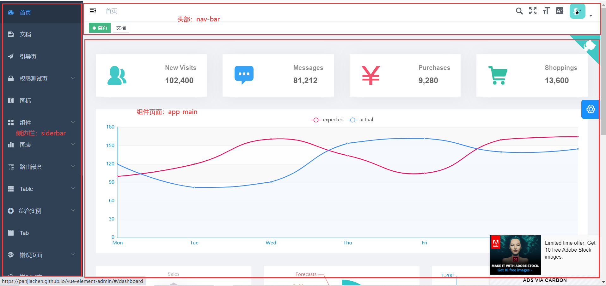
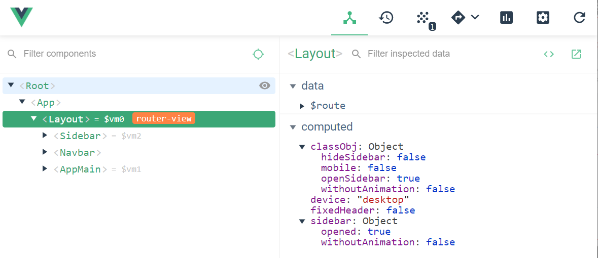

## 页面骨架Layout
整个vue根实例就只有一个router-view路由出口：
```html
<template>
  <div id="app">
    <router-view />
  </div>
</template>

<script>
export default {
  name: 'App'
}
</script>
```
所有的页面组件都会展示在这里，这里用到vue-router的嵌套路由，整个项目除了登录页面和404页面外，其他页面组件都用一个Loyout组件来包裹，一级路由对应的组件都是Layout,构成了整个页面的骨架：

当前Layout组件的骨架包括：侧边栏sidebar、头部navbar和主体区域appmain，从代码和Vue Devtools中也可以很清楚的看出Layout骨架结构：
```html
// 这里省掉了传入组件的值和样式
<template>
  <div>
    <sidebar />
    <div class="main-container">
      <div
        <navbar />
      </div>
      <app-main />
    </div>
  </div>
</template>
```

## 侧边栏Sidebar
### el-scroller
侧边栏整体上就是一个导航菜单列表，当列表项过多时就需要用滚动条来展示。(el-scroller并没有写在element-ui的官方文档中，项目引入了完整的element-ui，在这里只是简单的使用没有传递任何属性值。)
### el-menu
菜单列表是侧边栏的主体，主要是配置一些菜单属性
```html
<el-menu
    :default-active="activeMenu"
    :collapse="isCollapse"
    :background-color="variables.menuBg"
    :text-color="variables.menuText"
    :active-text-color="variables.menuActiveText"
    :unique-opened="false"
    :collapse-transition="false"
    mode="vertical"
>
```
- default-active表示当前激活菜单的 index，计算属性,依赖于当前子路由，可以在路由中配置meta指定激活菜单
- collapse表示是否水平折叠。计算属性，依赖store，使用vuex管理
- background-color表示菜单项的背景颜色，text-color表示菜单项的文字颜色，active-text-color表示激活菜单项的文字颜色。这些值都使用scss的变量，用一个样式文件统一管理。
### sidebar-item
- **子菜单**or**子菜单项**

判断当前路由的children，如果声明的children里的子路由大于1个，或者配置路由时显示指定alwayShow:true，则使用**子菜单**组件，并递归使用siderbar-item组件。否则，使用**子菜单项**组件。
```html
<template>
  <div v-if="!item.hidden">
  // 这里判断子路由情况，也是递归组件的出口
    <template v-if="hasOneShowingChild(item.children,item) && (!onlyOneChild.children||onlyOneChild.noShowingChildren)&&!item.alwaysShow">
      <app-link v-if="onlyOneChild.meta" :to="resolvePath(onlyOneChild.path)">
        <el-menu-item :index="resolvePath(onlyOneChild.path)" :class="{'submenu-title-noDropdown':!isNest}">
          <item :icon="onlyOneChild.meta.icon||(item.meta&&item.meta.icon)" :title="onlyOneChild.meta.title" />
        </el-menu-item>
      </app-link>
    </template>

    <el-submenu v-else ref="subMenu" :index="resolvePath(item.path)" popper-append-to-body>
      <template slot="title">
        <item v-if="item.meta" :icon="item.meta && item.meta.icon" :title="item.meta.title" />
      </template>
      // 组件递归引用
      <sidebar-item
        v-for="child in item.children"
        :key="child.path"
        :is-nest="true"
        :item="child"
        :base-path="resolvePath(child.path)"
        class="nest-menu"
      />
    </el-submenu>
  </div>
</template>
```
### applink组件
- **组件路由**or**外部链接**

link使用**动态组件**，用于判断是使用router-link还是使用a标签
```html
<template>
  <component :is="type" v-bind="linkProps(to)">
    <slot />
  </component>
</template>

<script>

export default {
  // ......
  computed: {
    isExternal() {
      return isExternal(this.to)
    },
    type() {
      if (this.isExternal) {
        return 'a'
      }
      return 'router-link'
    }
  },
  methods: {
    linkProps(to) {
      if (this.isExternal) {
        return {
          href: to,
          target: '_blank',
          rel: 'noopener'
        }
      }
      return {
        to: to
      }
    }
  }
}
</script>

```

### item组件
- item组件包含两个属性：icon和title
```html
<script>
export default {
  name: 'MenuItem',
  functional: true,
  props: {
    icon: {
      type: String,
      default: ''
    },
    title: {
      type: String,
      default: ''
    }
  },
  render(h, context) {
    const { icon, title } = context.props
    const vnodes = []

    if (icon) {
      if (icon.includes('el-icon')) {
        vnodes.push(<i class={[icon, 'sub-el-icon']} />)
      } else {
        vnodes.push(<svg-icon icon-class={icon}/>)
      }
    }

    if (title) {
      vnodes.push(<span slot='title'>{(title)}</span>)
    }
    return vnodes
  }
}
</script>


```
## Navbar
头部导航栏包含三部分：
- 用于控制侧边栏收缩的🍔 hamburger组件
- 面包屑组件 breadcrumb
- 用户设置
### hamburger组件
- 在全局store中管理侧边栏收缩状态 ```opened``` ：
```html
<hamburger 
  :is-active="sidebar.opened" 
  class="hamburger-container" 
  @toggleClick="toggleSideBar" />
  <script>
methods: {
  ...mapGetters([
      'sidebar',
      'avatar'
  ]),
  toggleSideBar() {
    this.$store.dispatch('app/toggleSideBar')
  },
  ...
}
<script/>
```
### breadcrumb组件
- 使用element的组件el-breadcrumb和子组件el-breadcrumbitem
- 其中el-breadcrumbitem是一个列表，通过监听路由的变化，重新渲染对应的列表
## AppMain
app-main组件就是嵌套子路由的路由出口，各个功能模块的组件都会在这里展现
```html
<section class="app-main">
    <transition name="fade-transform" mode="out-in">
      <router-view :key="key" />
    </transition>
</section>

export default {
  name: 'AppMain',
  computed: {
    key() {
      return this.$route.path
    }
  }
}
```