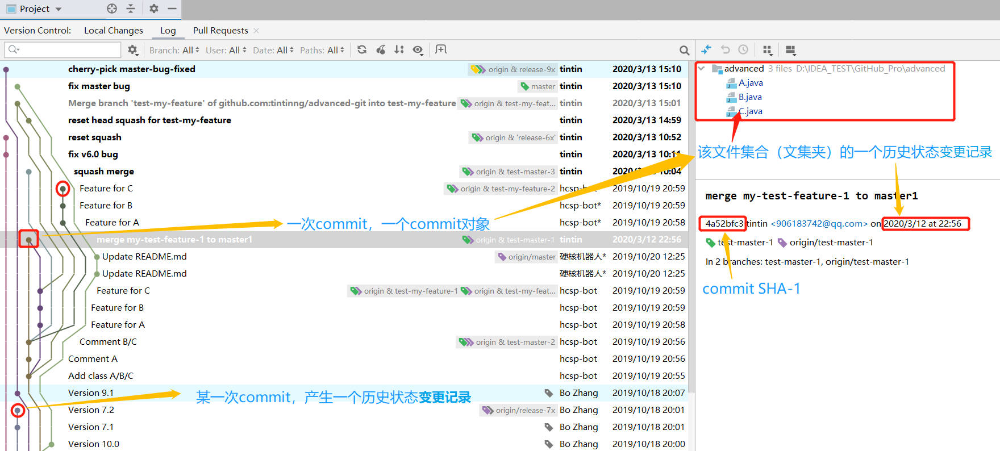
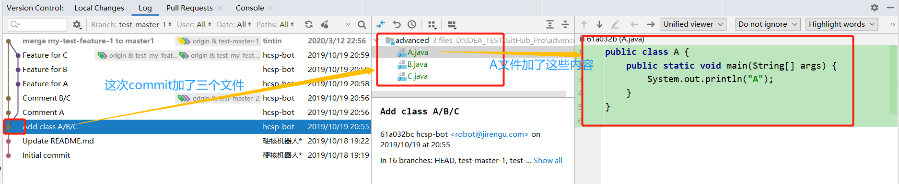
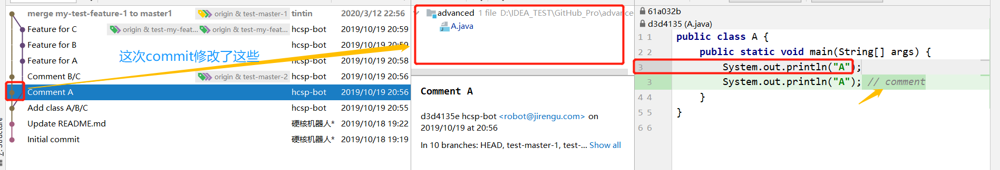
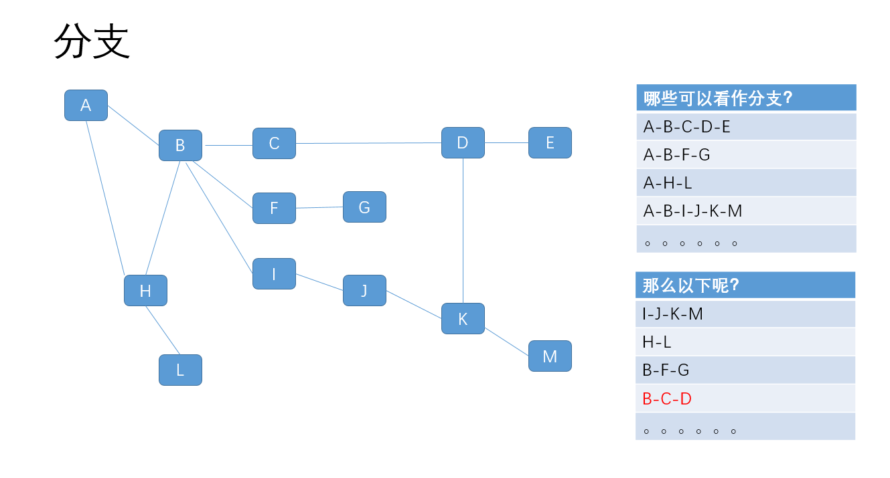
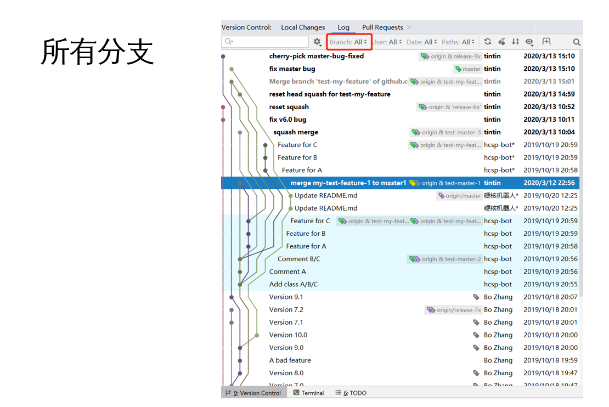
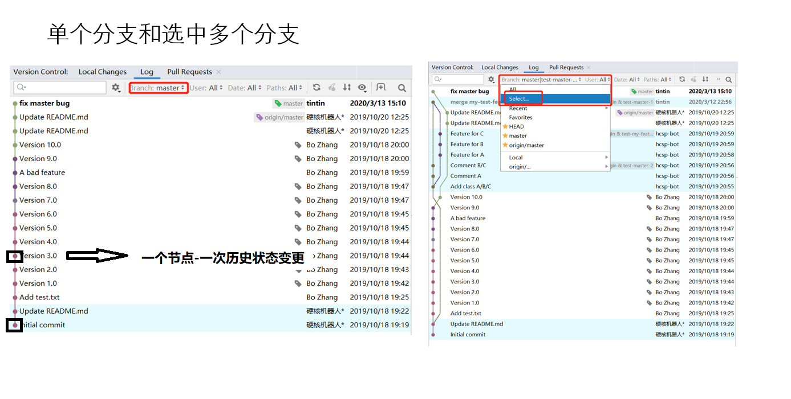
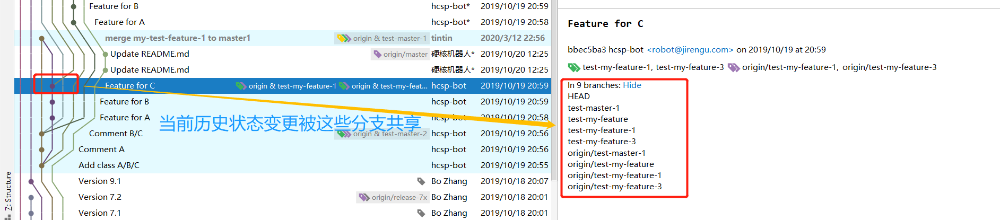
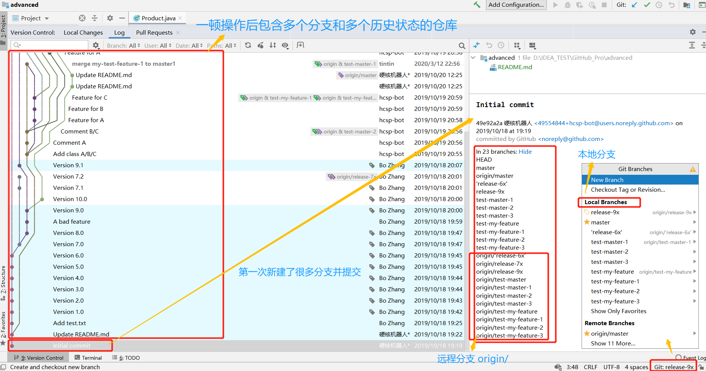

---

---
图例来自于一个demo练习[仓库](https://github.com/tintinng/advanced-git/tree/master)
### 什么是仓库？
仓库是指一个历史**可追溯（tracked）**的文件集合，可以把该文件集合的任意一个历史状态变更看成是一个单位，图中的一个个小圆点即为该仓库的某个**历史状态变更**。

### 这个历史状态变更时如何产生的？
**通过commit**，每一次commit就会生成一个commit对象，产生一次历史状态变更。因此这一个个小圆点也可以看成是一各个commit对象。


### 如何标识这个历史状态变更？
- Commit对象的SHA-1
- 分支（branch）
- HEAD指针
- tag标签
### 什么是分支？

- 分支是一个**指向叶子节点**的**指针**，**每个节点都是一个历史状态变更**。叶子节点可以理解为最新的历史状态变更。
- 一个分支包括多个历史状态变更（节点），可以在本分支的各个历史状态变更（节点）中穿梭。
- 一个仓库通常有各种分支错综复杂，IDEA 可视化log中可以可以查看各个分支之间的关系。单个分支，select几个分分支和所有分支：


### 各个分支之间有什么关系？
- 各个分支之间可以共享某些节点（历史状态变更）。**“我们曾经都做过这样的修改”**

- 多个分支可以合并，产生一个新的历史状态变更。例：我正在master分支上，要把fixbug分支上的变更内容合并过来。我（master分支）的历史状态变更向前推进一个，fixbug分支还停留在原来的历史状态变更上。
```java
git merge fixbug
```
- 可以切换当前的工作分支，即从一个分支可以切换到（checkout）另一个分支。切换到另一个分支上工作。
### 远程分支和本地分支对应
- push成功的条件就是远程分支是我本地分支的父亲，意思就是**远程做过的修改（历史状态变更/节点）我本地都做过了，所以我可以push成功，否则远程分支有另外的修改（有分叉）但我本地却没有，因此push会产生冲突**。通过合并（merge）\解决冲突（solve conflict）后再合并（merge）。
- 同理，pull（fetch+merge）成功的条件是本地分支是远程分支的父亲。


